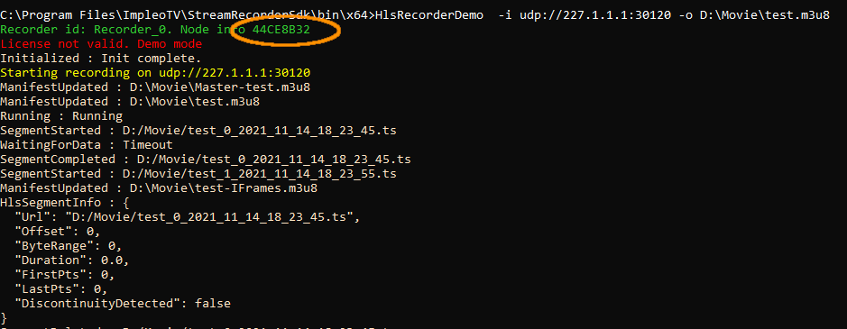

<div align="center">
  <a >
    
  </a>
</div>

# TS Recorder SDK
**TS Recorder SDK** is an "ITAR-free" library that provides stream/file playback and MISB KLV extraction/decoding functionality.  
More [info](https://impleotv.com/products/sdks/tsrecorder-sdk/).

## System Requirements
OS: Windows 10 64 bit.
## Installation

**TS Recorder SDK** can be downloaded as a **zip** file that contains installer. Unzip the **SetupStreamRecorderSDK.zip** file and run the **SetupStreamRecorderSDK.exe**.  

## Download link

|       | Version                  | Download link                                                                 | 
|:------|:------------------------:|:------------------------------------------------------------------------------|
| **TS Recorder SDK**  |  v1.0.22 | [SetupStreamRecorderSDK.zip](https://github.com/impleotv/ts-recorder-sdk-release/releases/latest/download/SetupStreamRecorderSDK.zip) | 


*Released on Sun, 14 Nov, 18:37 GMT+2*

## License

**TS Recorder SDK** is a node locked software. In order to get the license, please install it and fill an [online form](https://docs.google.com/forms/d/e/1FAIpQLSd_XW6bDsFce1G1cpds4gMQNlwNax0CvkWzcMbscxZ5rLaIbA/viewform), providing the ***Node Info*** string (IMPORTANT!!!) for the target machine.  
***Node Info*** string can be seen when you run the demo app, as shown below.  

```
"C:\Program Files\ImpleoTV\StreamRecorderSdk\bin\x64\HlsRecorderDemo.exe" -i udp://227.1.1.1:30120 -o C:\Movie\test.m3u8
```

<div align="center">
  <a >
    
  </a>
</div>  

Please copy-paste *Node Info*, don't send an image...

You'll get back a **license** file and a **key** that can be used in ***Activate*** method

> For large quantities, please contact us for an **unlocked license**.
